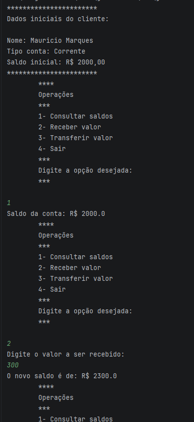

# 🏦 Caixa Eletrônico no Terminal

Aplicação de console em **Java** que simula as operações básicas de uma conta bancária: consultar saldo, receber valores e transferir valores, com validação de saldo insuficiente.


## 📋 Sobre o projeto

Projeto desenvolvido para praticar os fundamentos de Java: variáveis, entrada de dados com `Scanner`, estruturas condicionais, laços de repetição e formatação de texto com *text blocks* e `printf`.

## ✨ Funcionalidades

- **Consultar saldo:** exibe o saldo atual da conta
- **Receber valor:** adiciona um valor ao saldo
- **Transferir valor:** debita um valor do saldo, impedindo transferências acima do saldo disponível
- **Sair:** encerra o programa
- Tratamento de opção inválida no menu

## 🖥️ Exemplo de execução

```
***********************
Dados iniciais do cliente:

Nome: Mauricio Marques
Tipo conta: Corrente
Saldo inicial: R$ 2000,00
***********************

Operações

1- Consultar saldos
2- Receber valor
3- Transferir valor
4- Sair

Digite a opção desejada:
```
`.

## 🛠️ Tecnologias

- Java 25
- IntelliJ IDEA
- Git e GitHub

## ▶️ Como executar

1. Clone o repositório:
```bash
   https://github.com/Marqzzs/Desafio.git
```
2. Abra o projeto no IntelliJ IDEA.
3. Execute o método `main` pelo botão ▶️ ao lado do código.

Ou, pelo terminal (com JDK 25 instalado):

```bash
java Main.java
```

## 📚 O que pratiquei

- Entrada de dados com `Scanner`
- `while` e `if / else if / else`
- Formatação com `printf` e text blocks
- Validação de entrada do usuário
- Versionamento com Git e GitHub

## 🚀 Próximos passos

- [ ] Separar a lógica em classes (`Conta`, `Cliente`)
- [ ] Adicionar histórico de transações
- [ ] Validar entradas inválidas (letras, valores negativos)
- [ ] Formatar valores no padrão brasileiro (`R$ 2.000,00`)

## 👤 Autor

**Maurício Marques Pereira**

[](https://github.com/Marqzzs)
[](https://linkedin.com/in/maurício-marques-dev)
